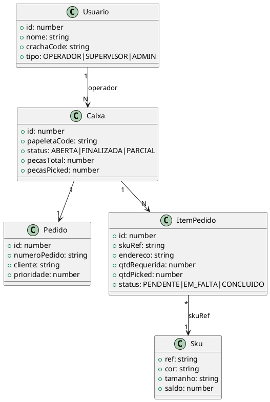
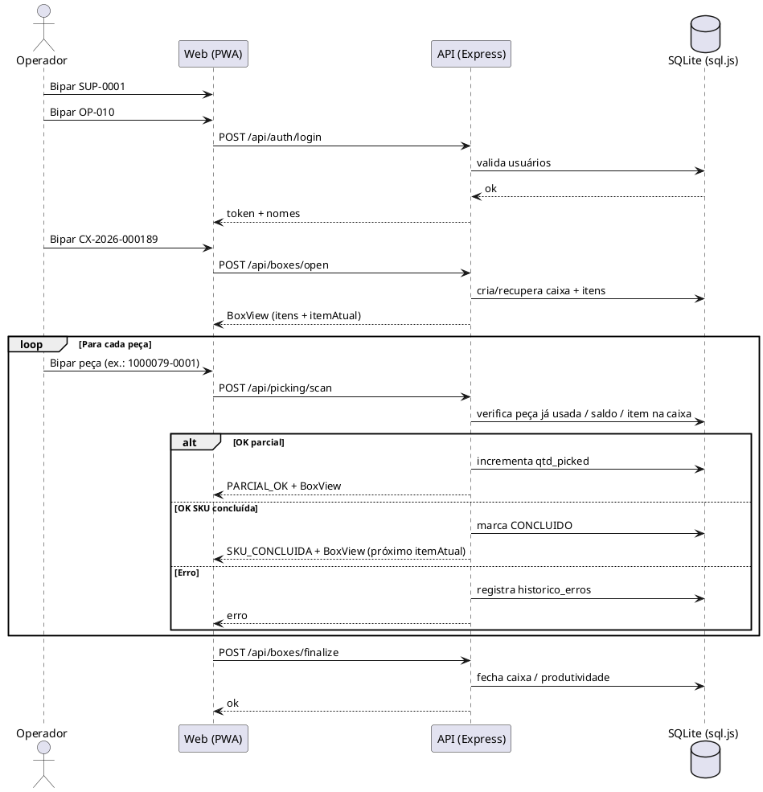

# UML básica — Kyly Picking

## Diagrama de Classes (alto nível)

PlantUML (texto):

```plantuml
@startuml
class Usuario {
  +id: number
  +nome: string
  +crachaCode: string
  +tipo: OPERADOR|SUPERVISOR|ADMIN
}

class Caixa {
  +id: number
  +papeletaCode: string
  +status: ABERTA|FINALIZADA|PARCIAL
  +pecasTotal: number
  +pecasPicked: number
}

class Pedido {
  +id: number
  +numeroPedido: string
  +cliente: string
  +prioridade: number
}

class ItemPedido {
  +id: number
  +skuRef: string
  +endereco: string
  +qtdRequerida: number
  +qtdPicked: number
  +status: PENDENTE|EM_FALTA|CONCLUIDO
}

class Sku {
  +ref: string
  +cor: string
  +tamanho: string
  +saldo: number
}

Usuario "1" --> "N" Caixa : operador
Caixa "1" --> "1" Pedido
Caixa "1" --> "N" ItemPedido
ItemPedido "*" --> "1" Sku : skuRef
@enduml
```

## Diagrama de Sequência — Fluxo Principal de Picking

```plantuml
@startuml
actor Operador
participant "Web (PWA)" as Web
participant "API (Express)" as API
database "SQLite (sql.js)" as DB

Operador -> Web : Bipar SUP-0001
Operador -> Web : Bipar OP-010
Web -> API : POST /api/auth/login
API -> DB : valida usuários
DB --> API : ok
API --> Web : token + nomes

Operador -> Web : Bipar CX-2026-000189
Web -> API : POST /api/boxes/open
API -> DB : cria/recupera caixa + itens
API --> Web : BoxView (itens + itemAtual)

loop Para cada peça
  Operador -> Web : Bipar peça (ex.: 1000079-0001)
  Web -> API : POST /api/picking/scan
  API -> DB : verifica peça já usada / saldo / item na caixa
  alt OK parcial
    API -> DB : incrementa qtd_picked
    API --> Web : PARCIAL_OK + BoxView
  else OK SKU concluída
    API -> DB : marca CONCLUIDO
    API --> Web : SKU_CONCLUIDA + BoxView (próximo itemAtual)
  else Erro
    API -> DB : registra historico_erros
    API --> Web : erro
  end
end

Web -> API : POST /api/boxes/finalize
API -> DB : fecha caixa / produtividade
API --> Web : ok
@enduml
```

